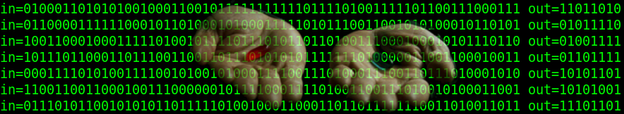

# Network of binary neurons
This is an attempt to create AI but not AI in the modern sense of the word.  
It is AI in the original meaning coinciding with the meanings of the following synonyms:  
- Artificial general intelligence (AGI);  
- Strong artificial intelligence (Strong AI);  
- Human-level artificial intelligence (HLAI);  
- True artificial intelligence (True AI).

## Project directories

#### ./src/brain/
This folder contains everything you need for a project based on binary neurons

##### brain.h, brain.cpp
Contains the brain class - the basis of the project

##### pch.h
Contains the initial definitions

##### random_put_get.h, random_put_get.cpp  
Contains the random_put_get class. Easy and fast random numbers.  
First you put, then you get random numbers.

##### simple_math.h
Contains the simple_math struct. Easy and fast matematics.

###### Build
make
make all
make clean

#### ./src/examples/
Examples directory. See the [./src/examples/README.md](../master/src/examples/) file for details

## Author
Ilya Shishkin  
mailto:cortl@8iter.ru

## Home page
[http://8iter.ru/ai.html](http://8iter.ru/ai.html "google translator to help!")

## GitHub reference
https://github.com/cortl0/network_of_binary_neurons_cpp

## License
This project is licensed under the GPL v3.0 - see the LICENSE file for details
